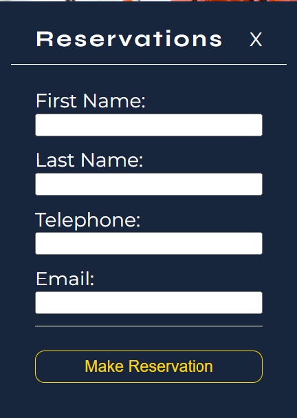

# aquaStella - 2 Michelin Star Restaraunt

Aqua’ Stella is a fictitious Michelin star restaurant that styles itself around seafood.

The restaurant is a small and unique dining experience with only 16 seats catering for 2 sittings, so 32 possible seats per night.

The target audience is based on fictitious data that the website will cater for in voice and imagery.
 
This project will focus on the table booking feature for the visitor and the provision of a data dashboard for the owner.

The link to the live aquastella website is here: [aquastella](https://doyle-kfd.github.io/aquastella/index.html)


# The approach I took

<details>
<summary>Intro</summary>


</details>
<details>
<summary>Agenda</summary>


</details>
<details>
<summary>Project Introduction</summary>


</details>
<details>
<summary>What Problem I Solve</summary>


</details>
<details>
<summary>Target Audience</summary>


</details>
<details>
<summary>Persona 1</summary>


</details>
<details>
<summary>Persona 2</summary>


</details>
<details>
<summary>User Story - Sid The Sailor</summary>


</details>
<details>
<summary>User Story - Michelin Mike</summary>


</details>

<details>
<summary>Proposed Solution</summary>


</details>

<details>
<summary>I Will Deliver</summary>


</details>


# Features and benefits

## Navigation
- The responsive navigation bar links the logo, Home, Gallery and login pages.
    - There is an admin page which is accessed through the login option on the main navigation.
    - Once logged in, the admin page is added to the main navigation and a logout link is added, while the login link is removed.
-   The main navigation has a drop shadow to give a 3D effect.

### Mobile phone Navigation

| Mobile Phone  |   Mobile Dropdown Admin Logged Out  |   Mobile Dropdown Admin  Logged In    |
|------------|----------------|----------------|
|                |                    |              


### Ipad - Laptop Navigation


| Admin Logged Out |   Admin Logged In  |
|------------|----------------|
|                |                    |     


### Footer 
- The footer is displayed differently on mobile and Ipad/Laptop screens
- The footer is primarly displayed on mobile with CTA'S ( calls to action).
- The footer on ipad/Laptop devices in includes the social media icons.


| Mobile Phone |   iPad - Laptop   |
|------------|----------------|
|                |                    |  


## Index

- #### Note:
    - The index page sets the scene for the Michelin feel
        - Images reflecting the speciality
        - The chef
        - The produce used
    - It explains the category the restaraunt focuses on.
    - The imagery and text is based on the targeted demographic in the personas.

- ####  Hero Section 

    - The hero image with text sets the shows that we specialise in seafood.
    - The image and the text provides a clear expectation of what the visitor should expect on arrival.
    - The contrasting text over the image delivers the usp to the website visitor.


| Mobile Phone |   iPad - Laptop   |
|------------|----------------|
|                |                    |  


- #### Welcome Section
    - The welcome section explains how the restaraunt name came about.
    - Educating the website visitor will add to the experience.
    - The welcome section educates the visitor about the speciality and states the value propisition.


- #### Our Story
    - The image in our story shows the inside of the proposed restaraunt with a table setting.
    - The complimenting text sells the story of passion and creativity.
    - The message explains that its not just about the food, its the experience.
    - The quote from the chef sells the focus of the restaraunt. Let the food speak.


- #### Chef Marco
    - The picture and narative of chef marco complement eachother.
    - The image is indicitive of the typo of male chef that would come from the local village in Sardinia.
    - The textual content sells the experience of the chef, having understudied with the greats.


- #### What Matters
    - The imagery and the textual content are complimentary.
    - Like all exceptional chefs, its about the ingredients.
    - Selling the relationship with the local skippers, as a result getting the best produce.


### Gallery
- #### Note:
    - The gallery is based on a responsive masonary style.
    - The images showcase they type of food the website visitor can expect.
    - The gallery supports the index page to sell the experience to the website visitor.

- #### Masonary Gallery
    - The gallery has been designed using flexbox.
    - The three devices, mobile, iPad and laptop display differently based on responsiveness.


| Mobile Phone |   iPad  |     Laptop |
|------------|----------------|-------------------|
|                |                    |                                                                                                                           |


## Forms
- #### Note:
    - There are two forms on the website
        -   Admin login
        -   Reservation form


### Admin Login Form
  

 The admin login form is accessed throught the login link in the main menu.
 To gain access, the credentials are Userid: admin Password: 12345

 On authentication, two new links will appear in the main menu, admin, and the logout link.
 On clicking the logout link, the admin page will be removed and the logout link will be removed.


### Reservation Form

| Tab 1 |   Tav 2  |     Confirmation        |
|------------|----------------|-------------------|
|                |                    |                  


- #### Admin Page
    - The admin page holds three main sections
        -   Counters
        -   Table of reservations
        -   Graphs of reservations
    - The counters and graphs show numerical and graphical represenations of todays reservations and the next 7 days.
    - The table holding the reservations is populated automatically on the first visit to the site, courtesy of an array.
        - The array fills the next 30 days for half the seats available for both sittings, to get started.
        - Following the array populating, each reservation you add will be appended.

#### Mobile Dashboard


The reservations table has a horizontal scroll bar to facilitate mobile table navigation


| Counters |   Reservations Table  |     Graphs     |
|------------|----------------|-------------------|
|                |                    |                 

#### iPad/Laptop Dashboard


| Counters |   Reservations Table  |     Graphs     |
|------------|----------------|-------------------|
|                |                    |                 

## Given the time, I would implement

- a proper scoping phase, talking to a real restaraunt
- surveys and workshops to find out the bullseye customer in order to increase sales
- eCommerce integration to take booking fee
- Dashboards to show the monetary value of reservations and historical sales
- in depth validation of the forms
- On the reservation page, a suitable graphic to offer sittings available on specific upcoming dates
- a database integration for adminstrator authentication
- a CRUD interface on the authenticated dashboard for reservation updates

## Design

### Overall comments
The imagery and textual content is combined to give a sense of value. The voice is used to convey the authenticity of the restaraunt as a seafood specialist.

### Imagery
The imagery used is cohesive. The message is seemless. It build credibility during the visit.

### Colours
THe colors are used to add a richer feel to the restaraunt.

### Fonts
The fonts used are from Google's library
- For Headings [Syne](https://fonts.google.com/specimen/Syne)
- For Text [Montserrat](https://fonts.google.com/specimen/Montserrat)


## Wireframes
<details>
<summary>Mobile Phone</summary>


</details>
<details>
<summary>Tablet</summary>


</details>
<details>
<summary>Laptop</summary>


</details>

## Deployment
The project was deployed using GitHub pages. The steps to deploy using GitHub pages are:
1. Go to the repository on GitHub.com
2. Select 'Settings' near the top of the page.
3. Select 'Pages' from the menu bar on the left of the page.
4. Under 'Source' select the 'Branch' dropdown menu and select the main branch.
5. Once selected, click the 'Save'.
6. Deployment should be confirmed by a message on a green background saying "Your site is published at" followed by the web address. 

Live site can be viewed here: [aquastella](https://doyle-kfd.github.io/aquastella/admin.html)

## Cloning

To clone the aquastella repository
1. On GitHub.com, navigate to the main page of the repository.
2. Above the list of files, click  Code.
3. Copy the URL for the repository.
4. Open Git Bash.
5. Change the current working directory to the location where you want the cloned directory.
6. Type git clone, and then paste the URL you copied earlier.
7. ress Enter to create your local clone.

Full instructions on cloning can be found here: [Cloning Instructions ](https://docs.github.com/en/repositories/creating-and-managing-repositories/cloning-a-repository)

## Credits

### Content

The concept for the KSail website is based on the real life offerings from the RSGYC.

[Michelin Star Seafood Restaraunts Ireland](https://guide.michelin.com/ie/en/best-of/best-of-fish-and-seafood-restaurants-in-the-republic-of-ireland)

The responsive design is based on the "I love running site"

Restaraunts used in reference:
-  [Coletta](https://www.collettarestaurant.com/)
-  [The Original](https://www.theogdenver.com/our-story/)
-  [Cush](https://cush.ie/)

### Features

-   Codeinstitute 
    -   Header, Footer Styling, Flex concept - Love Running Tutorial

-   Codinstitue JS essentials
    -   iteration
    -   Listners
    -   Template literals
    -   Getting elements by class and Id
    -   Setting style values
    -   Event Listners
    -   Checking for page load
    -   Arrays
        -   pair keys
        -   filter
        -   reduce
        -   arrow functions

-   geeksforgeeks
        - [Form Validation](https://www.geeksforgeeks.org/form-validation-using-javascript/)
       


-   W3Sschools
    - [array methods](https://www.w3schools.com/js/js_array_methods.asp)
    - [array iteration](https://www.w3schools.com/js/js_array_iteration.asp)
    - [arrow functions](https://www.w3schools.com/js/js_arrow_function.asp)
    - [redirect to another page](https://www.w3schools.com/howto/howto_js_redirect_webpage.asp)
    - [Js Mobile Menu](https://www.w3schools.com/howto/howto_js_mobile_navbar.asp)
    - [JS login form](https://www.w3schools.com/howto/howto_css_login_form.asp)
    - [JS multiple step form](https://www.w3schools.com/howto/howto_js_form_steps.asp)
    - [Form Validation](https://www.w3schools.com/js/js_validation.asp)

-   MDN
    -   [array methods](https://developer.mozilla.org/en-US/docs/Web/JavaScript/Reference/Global_Objects/Array)
    -   [arrow functions](https://developer.mozilla.org/en-US/docs/Web/JavaScript/Reference/Functions/Arrow_functions)

-   Stackoverflow
    -  [Date formatting](https://stackoverflow.com/questions/3552461/how-do-i-format-a-date-in-javascript)
    -  [Local Storage](https://stackoverflow.com/questions/2010892/how-to-store-objects-in-html5-localstorage-sessionstorage)


-   emailJS - Sendmail for order confirmation

-   Google Charts
    - [drawchart](https://developers.google.com/chart/interactive/docs/quick_start)
    

### CSS References
- Flexbox   
    -  [W3Schools](https://www.w3schools.com/css/css3_flexbox.asp)
    -  [MDN](https://developer.mozilla.org/en-US/docs/Web/CSS/flex)


### Favicon

- [Favicon generator ](https://favicon.io/favicon-generator/)

### Images

-   Index Page:
    - Hero Section      [Unsplash](https://unsplash.com/photos/person-holding-stainless-steel-spoon-ZW9CSUdANqw)
    - Our Story Section [Opentable](https://www.opentable.com/r/moonstone-grill-trinidad?corrid=515922c4-5f4f-48d5-ac45-95c4944415ae&avt=eyJ2IjoyLCJtIjoxLCJwIjowLCJzIjowLCJuIjowfQ&p=2&sd=2024-07-22T23%3A30%3A00)
    - Chef Marco        [Pixbay](https://pixabay.com/photos/platting-fine-dining-vegan-4282018/)
    - What matters to us [Pixbay](https://pixabay.com/photos/fish-food-market-sale-seafood-1841183/)

-   Gallery Page [Pixbay](https://pixabay.com/photos/)


# Testing

## Feature Testing

### Nav Bar


| Feature    |   Test Case    |   Outcome      |
|------------|----------------|----------------|
| Logo       |  Click On Logo |  User brought to home page   |
| Navbar - Reservation Button | Click on reservation button on each page | Reservation popup works on each page |
| Navbar - Gallery Page | Click on Gallery link on each page | User is brought to Gallery page |
| Navbar - Login Page | Click on the login link on each page | Login popup works on each page |
| Navbar - Admin Page | Once logged in, admin page link in menu should be visible on each page | Login page is visible on each page |
| Navbar - Logout Link Visible | Once logged in, logout link should be visible on each page | Logout link is visible on each page |
| Navbar - Logout Link Click | Once clicked, logout link should remove admin page and logout link from menu. Redirecing to home page | Logout link works on each page, removes admin link from menu and redirects to home page |


### Footer


| Feature    |   Test Case    |   Outcome      |
|------------|----------------|----------------|
| Footer - Index Page -  Reservation button | Click on footer reservation button | Reservation popup opens |
| Footer - Index Page -  Facebook link | Click on footer Facebook link | New Tab opens with Facebook |
| Footer - Index Page -  Instagram link | Click on footer Instagram  link | New Tab opens with Instagram |
| Footer - Index Page -  WhatsApp link | Click on footer WhatsApp link | New Tab opens with WhatsApp |
| Footer - Index Page -  Telephone link | Click on footer Telephone link | On Mobile Phone, Phone dialer with phone number ready |
| Footer - Index Page -  Telephone link | Click on footer Telephone link | On Tablet or Laptop, Popup with pick an app message |
| Footer - Gallery Page -  Reservation button | Click on footer reservation button | Reservation popup opens |
| Footer - Gallery Page -  Facebook link | Click on footer Facebook link | New Tab opens with Facebook |
| Footer - Gallery Page -  Instagram link | Click on footer Instagram  link | New Tab opens with Instagram |
| Footer - Gallery Page -  WhatsApp link | Click on footer WhatsApp link | New Tab opens with WhatsApp |
| Footer - Gallery Page -  Telephone link | Click on footer Telephone link | On Mobile Phone, Phone dialer with phone number ready |
| Footer - Gallery Page -  Telephone link | Click on footer Telephone link | On Tablet or Laptop, Popup with pick an app message |
| Footer - Admin Page -  Reservation button | Click on footer reservation button | Reservation popup opens |
| Footer - Admin Page -  Facebook link | Click on footer Facebook link | New Tab opens with Facebook |
| Footer - Admin Page -  Instagram link | Click on footer Instagram  link | New Tab opens with Instagram |
| Footer - Admin Page -  WhatsApp link | Click on footer WhatsApp link | New Tab opens with WhatsApp |
| Footer - Admin Page -  Telephone link | Click on footer Telephone link | On Mobile Phone, Phone dialer with phone number ready |
| Footer - Admin Page -  Telephone link | Click on footer Telephone link | On Tablet or Laptop, Popup with pick an app message |


### Reservation Form

The reservation form is made of of three forms,

-   Tab 1 : Number of guests, date and sitting
-   Tab 2 : First name, Last name, Telephone, Email
-   Tab 3 : Reservation confirmation - if successful. 


| Feature    |   Test Case    |   Outcome      |
|------------|----------------|----------------|
| Reservation Form Tab-1 | Close button top right of form -  click  |  Reservations form closes|
| Reservation Form Tab-1 | Number of guests - leave out,click find a table |  Please fill in all fields message appears under button|
| Reservation Form Tab-1 | Date - leave out, click find a table |  Please fill in all fields message appears under button|
| Reservation Form Tab-1 | Sitting Time  - leave out, click find a table |  Please fill in all fields message appears under button|
| Reservation Form Tab-1 | Leave all fields empty -  click find a table |  Please fill in all fields message appears under button|
| Reservation Form Tab-1 | Test for overbooking on sitting, max 16 seats available  |  Message under find a table button "Sitting full Pleast try again"|
| Reservation Form Tab-2 | Close button top right of form -  click  |  Reservations form closes|
| Reservation Form Tab-2 | First name - leave out, click make reservation |  Please fill in all fields message appears under button|
| Reservation Form Tab-2 | Last name - leave out, click make reservation |  Please fill in all fields message appears under button|
| Reservation Form Tab-2 | Telephone - leave out, click make reservation |  Please fill in all fields message appears under button|
| Reservation Form Tab-2 | Email - leave out, click make reservation |  Please fill in all fields message appears under button|
| Reservation Form Tab-2 | Leave all fields empty -  click make reservation |  Please fill in all fields message appears under button|
| Reservation Form Tab-2 | Close button top right of form -  click  |  Reservations form closes|

| Sitting Full Message  |   Missing fields  |      |
|------------|----------------|----------------|
|                                                                       |                                                                                                  |                                                      |


### admin login form
The admin login form is on form.
The userid and password are required for validation
use values:
    userid : admin
    password: 12345

| Feature    |   Test Case    |   Outcome      |
|------------|----------------|----------------|
|      Click on login link in menu      |    login admin menu item clicked           |        Admin login form opens        |
|      Click on login button on form     |    login button clicked with no credentials entered          |       Message below login button displaying "Incorrect Credentials"       |
|      Click on login button on form     |    login button clicked with password and no username entered       |       Message below login button displaying "Incorrect Credentials"       |
|      Click on login button on form     |    login button clicked with username entered and no password       |       Message below login button displaying "Incorrect Credentials"       |
|      Click on login button on form     |    login button clicked with username entered and  password entered       |       login form closes, link to admin page added to menu       |


| No username error  |   No password error  |      |
|------------|----------------|----------------|
|                                                                       |                                                                                                  |                                                      |


## Browser Compatability

| Browser Tested    |   Intended Appearance   |   Intended Responsiveness     |
|-------------------|-------------------------|-------------------------------|
| Chrome            | Good                    | Good                          |
| Firefox           | Good                    | Good                          |
| Edge              | Good                    | Good                          |


## Responsiveness
| Device Tested     |   Site Responsive >= 280px  |   Site Responsive >=768    |     Site Responsive >=1200  | Render As Expected |
|-------------------|-----------------------------|----------------------------|-----------------------------|--------------------|
| Galaxy Fold       |      Good                   |             Good          |          Good               |      Good          |
| ipad              |       Good                  |            Good            |          Good               |      Good          |
| Laptop            |       Good                  |             Good           |         Good                |      Good          |


## Code Validation

> No Errors Found In Validated HTML/CSS

### Index page validation

<details>

<summary>index.html</summary>


</details>

### About page validation

<details>

<summary>gallery.html</summary>


</details>

### CSS Vaalidation

<details>
<summary>CSS Validation</summary>


</details>


## Bugs

<details>
<summary>White border around index page bottom image.</summary>

- Bug: Menu item active status under page title not working across all pages.
- Reason: targeting wrong id.
- Fix: Target the correct id.

    Before:
    ```
    /* What matters section index page */
    #what-matters {
    padding: 5px; /*  add padding around text */
    }
    ```
    After:
    ```
    /* What matters section index page */
    #what-matters-text {
    padding: 5px; /*  add padding around text */
    }
    ``` 


</details>

<details>

<summary>On admin page, graphs loading correctly but still showing error</summary>

-   Solution: Remove event listner.  
-   Reason: google related js already loading on page load, then when the listner runs it updates the google code unnecessarily giving the error.   

    Before:

    ```
    // Add event listner to check when DOM is fully loaded.
    document.addEventListener('DOMContentLoaded', function () {
        updateReservationsTable();

        // Listen for storage events-----------------------------------------------------------/////////////
        window.addEventListener('storage', function () {
            updateReservationsTable();
        });
    });
    ```

    
</details>

<details>

<summary>On login form click, menu disappears</summary>

- Problem: When the login form on tablets and laptops is clicked, the main menu disappears.
- Solution: css style on form being activated unnecessarily, remove the js code to display:block as default


Before:
```
resForm.style.display = "none"; // Close the menu
```

</details>
<details>

<summary>Counter checking available seats on a sitting on a specific date not working</summary>


- Problem: Counter checking available seats on a sitting on a specific date not working. This lead to over booking.
- Reason: date being set as dd-mm-yyyy and compared to yyyy-mm-dd.
- Solution: add date conversion code to compare dd-mm-yyyy to dd-mm-yyyy


</details>


## Lighthouse

<details>

<summary>index.html</summary>

|  |                                                             |
|-------------------|---------------------------------------------------------------------------------------------|
|          |  |   

</details>

<details>

<summary>gallery.html</summary>

|    |                                                                       |
|-------------------|---------------------------------------------------------------------------------------------|
|         | |   


</details>

<details>

<summary>admin.html</summary>

| |                                                                     |
|-------------------|---------------------------------------------------------------------------------------------|
|         |  |   


</details>


## Accessibility

### Tool used WAVE "Web Accessibility Evaluation Tool"

| index.html    |      gallery.html            |             admin.html   |          |
|---------------|----------------------------|----------------------------|-----------------------|
|               |                            |                            |                    | 


## JS Linter (JShint)

Using JShint, the following output was generated

|    Warnings        |  Undefined Variables   |       Unused Variables          |  
|--------------------|------------------------|---------------------------------|
|                      |                          |                                   |

